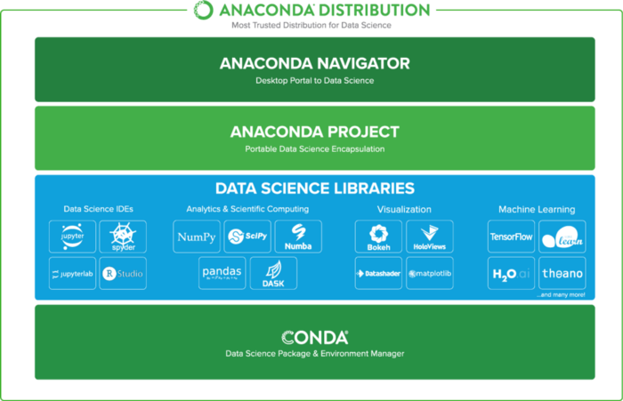
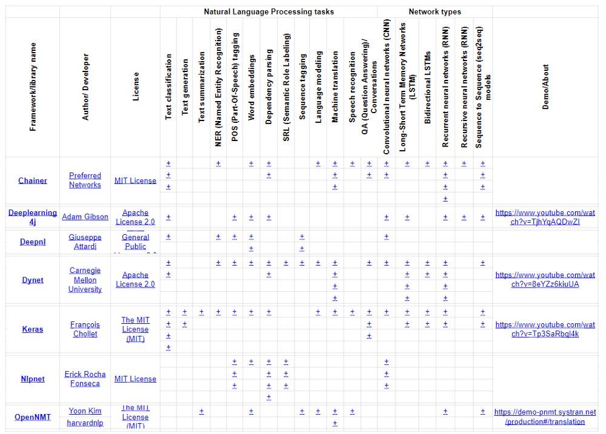
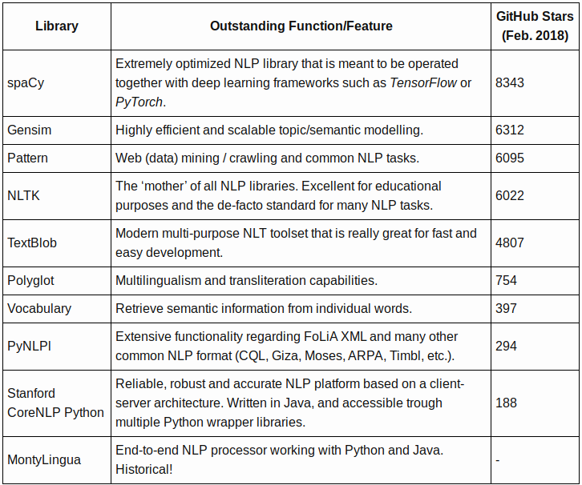

# Learning Deep Learning

## Tipos

### Supervisionado: conhecimento prévio das respostas

- Problema de regressão: contínuo
- Problema de classificação: discreto
- descida do gradiente em lote: encontrar os melhores pesos para a função
- Regressão linear multivariáveis: estima uma equação da reta e usa a equação para o "chute" baseado no local da linha (problemas lineares)
- Não linear: regressão linear mais inteligente, redes neurais ou SVMs (support-vector machines) com kernels.
- Overfitting: "decorou", possível superar com Regularization ou Cross-validation

### Não-supervisionado: oposto (I.A. Forte, replicar a habilidade de instinto)

- Clustering: agrupamento
- Association: associação

### Redes neurais

- Escalonamento de atributos (feature scaling)
- Função de ativação (activation function)
- Algoritmo sem memória = stateless algorithm (algoritmo sem estado)
- Rede neural recorrente (Recurrent Neural Network RNN): algoritmos com memória, boa para identificar padrões
- Seleção de caracteristicas (feature selection)
- Modelo simples = toy problem
- Aprender fora do padrão: janela deslizante (sliding window), mais dados (Rede neural profunda - deep neural network), convolução (convolution)
- Necessário dá a rede a compreensão de invariância de translação (translation invariance). É possível utilizando convolution
- Convolution: divide a (imagem) em recortes menores e sobrepostos, passa por uma rede simples (gera um vetor de resultados como saida), faz um downsampling (redução por amostragem = algoritmo max pooling)
- É necessário identificar "como" a rede falou e não apenas a percentagem das vezes em que ela falhou. (confusion matrix)
- Previsão e Revocação ou cobertura e sensibilidade (precision and recall).

### Reconhecimento facial

- Histogramas de Gadrientes Orientados (Histogram of Oriented Gradientes - HOG)
- Estimação de marcas da face (face landmark estimation)
- Transformações afins (Affine transformation)- transformações básicas que preservam as linhas paralelas. As imagens podem sofrer rotações, escalonamento e cisalhamento.
- Embedding: uma estrutura matemática contida em outra. É possível obter de forma injetiva (p.ex. definir uma estrutura da face para identificar as pessoas)

### Tradução

- Dicionário, modelo baseado em probabilidade e estatística, RNN e encoding
- Aprendizado sequência-para-sequência (sequence-to-sequence)
- Corpora paralela (parallel corpora): texto traduzido duplamente
- Codificação (encoding): combinação com RNN para construir um sistema de tradução que aprende sozinho.

### Reconhecimento de Voz

- Transformada de Fourier: Decompõe uma função temporal (sinal) em frequências, tal como acordes de um instrumento musical.

### Modelos geradores (generative models)

- Redes Adversariais Geradoras Convolucionais Profundas (DCGANs - Deep Convolutional Generative Adversarial Networks)

  - Duas redes que lutam entre si: discriminador (CNN) para identificação, gerador (CNN) para produzir.

### Enganar Redes Neurais

- Utilização de uma rede pré-treinada e n inserções dos dados com leves modificações até que ela deixe acertar a predição (exemplo adversário).
- Ataque de caixa preta (Utilizar uma rede substituta para gerar imagens hackeadas que serão capazes de enganar a rede neural original)
- Prevenção:

  - Treinamento adversarial: criar imagens hackeadas e incluí-las nos dados de treinamento.
  - Defensive Distillation: treinar segunda rede para imitar o modelo original (abordagem nova e complexa).

## Bibliotecas

### Geral para Data Science

- [ ] plotly (visualização)
- [ ] lime (confiança para modelos de ml)
- [ ] missingno (visualizando o que não existe)
- [ ] auto-sklearn (automl não entendi muito bem)
- [ ] pandas-profiling (report completo sobre o dataset)
- [ ] ann_visualizer (visualizador de redes neurais)
- [ ] featuretools (feature engineering)
- [ ] dask (aplicações nativas que escalam)
- [ ] numba (compilador python)
- [ ] Scikit-learn (data mining, data analysis, machine learning)
- [ ] Pandas (manipulação de dataset)
- [ ] Tensor flow (machine learning)
- [ ] TensorFlowLearn (deep learning, possível criar CNN facilmente)
- [ ] Keras (deep learning)
- [ ] Matplotlib (visual39 ização de dados)
- [ ] Numpy (manipular array e matrizes multidimensionais)
- [ ] seaborn (visualização de dados estatísticos)
- [ ] scipy (matemáticos, cientistas e engenheiros)
- [ ] pickle (serializar objetos python)
- [ ] joblib (executar funcões python como tarefas de pipeline, possui funções da pickle)
- [ ] OpenFace (reconhecimento facial)
- [ ] dlib (reconhecimento facial)

### Natural Language Processing (NLP)

 

- [ ] nltk (tokenization, lemmatization, stemming, parsing, POS tagging, etc.. for almost all NLP tasks)
- [ ] spacy (main competitor of the NLTK)
- [ ] scikit-learn (machine learning and tools for text preprocessing)
- [ ] gensim (topic and vector space modeling, document similarity)
- [ ] pattern (nlp only as a side task, server as the web mining module)
- [ ] textblob (providing an intuitive interface to NLTK. Competitor of the pattern)
- [ ] polyglot (is not very popular)
- [ ] Stanford CoreNLP (stanford group)
- [ ] OpenNLP
- [ ] Mallet
- [ ] Textacy (Work together spacy)
- [ ] PyTorch-NLP (new)
- [ ] Vocabulary (get its meaning, synonyms, antonyms, part of speech, translations and other such)
- [ ] PyNLPl (extraction of n-grams and frequency lists, and to build a simple language model)
- [ ] Quepy (transform natural language questions into queries in a database query language)
- [ ] fuzzywuzzy (Similaridade)

## Referências

[Aprendizagem de Máquina é Divertido](https://medium.com/machina-sapiens/aprendizagem-de-m%C3%A1quina-%C3%A9-divertido-8fe1513ce59f)

[Convolutional neural network](https://en.wikipedia.org/wiki/Convolutional_neural_network)

[Precision and recall](https://en.wikipedia.org/wiki/Precision_and_recall?source=post_page---------------------------)

[Affine transformation](https://en.wikipedia.org/wiki/Affine_transformation?source=post_page---------------------------)

[Transformação de cisalhamento](https://pt.wikipedia.org/wiki/Transforma%C3%A7%C3%A3o_de_cisalhamento?source=post_page---------------------------)

[Support-vector machine](https://en.wikipedia.org/w/index.php?title=Support-vector_machine&source=post_page---------------------------)

[Feature selection](https://en.wikipedia.org/wiki/Feature_selection?source=post_page---------------------------)

[Ensemble learning](https://en.wikipedia.org/wiki/Ensemble_learning?source=post_page---------------------------)

[Activation function](https://en.wikipedia.org/wiki/Activation_function?source=post_page---------------------------)

[State](https://en.wikipedia.org/wiki/State_(computer_science)?source=post_page---------------------------)

[Machine learning](https://en.wikipedia.org/wiki/Machine_learning?source=post_page---------------------------#Algorithm_types)

[Strong AI](https://en.wikipedia.org/wiki/Strong_AI?source=post_page---------------------------)

[Introduction to Gradient Descent](https://hbfs.wordpress.com/2012/04/24/introduction-to-gradient-descent/?source=post_page---------------------------)

[Artificial neural network](https://en.wikipedia.org/wiki/Artificial_neural_network?source=post_page---------------------------)

[Kernel method](https://en.wikipedia.org/w/index.php?title=Kernel_method&source=post_page---------------------------)

[Regularization](https://en.wikipedia.org/wiki/Regularization>_%28mathematics%29?source=post_page---------------------------#Regularization_in_statistics_and_machine_learning)

[Cross-validation](https://en.wikipedia.org/wiki/Cross-validation>_%28statistics%29?source=post_page---------------------------)

[Feature scaling](https://en.wikipedia.org/wiki/Feature_scaling?source=post_page---------------------------)

[Aprendizado de máquina](https://pt.wikipedia.org/wiki/Aprendizado_de_m%C3%A1quina?source=post_page---------------------------)
